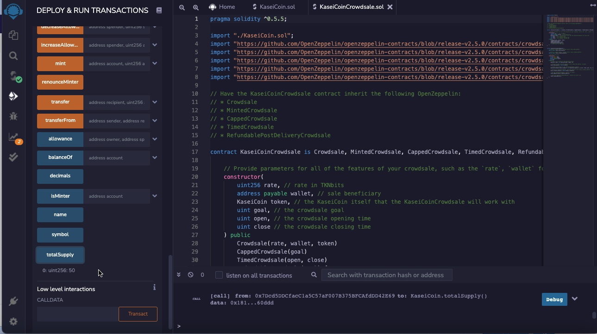

# Unit 21: Martian Token Crowdsale

## Background

After waiting for years and passing several tests, the Martian Aerospace Agency selected you to become part of the first human colony on Mars. As a prominent fintech professional, they chose you to lead a project developing a monetary system for the new Mars colony. You decided to base this new system on blockchain technology and to define a new cryptocurrency named **KaseiCoin**. (Kasei means Mars in Japanese.)

KaseiCoin will be a fungible token that’s ERC-20 compliant. You’ll launch a crowdsale that will allow people who are moving to Mars to convert their earthling money to KaseiCoin.

### Step 1: Create the KaseiCoin Token Contract

### Step 2: Create the KaseiCoin Crowdsale Contract

### Step 3: Create the KaseiCoin Deployer Contract

### Step 4: Deploy and Test the Crowdsale on a Local Blockchain

In this subsection, you’ll deploy the crowdsale to a local blockchain. You’ll then perform a real-world, preproduction test of your crowdsale. To do so, complete the following steps:

1. Deploy the crowdsale to a local blockchain by using Remix, MetaMask, and Ganache.

2. Test the functionality of the crowdsale by using test accounts to buy new tokens and then checking the balances of those accounts.

Below image shows total supply of minted tokens and the amount of wei that the crowdsale contract has raised.

### The `CappedCrowdsale` contract: Allows you to cap the total amount of ether that your crowdsale can raise.

Below image shows where the total quantity is capped and you cannot transact more than the cap set.

